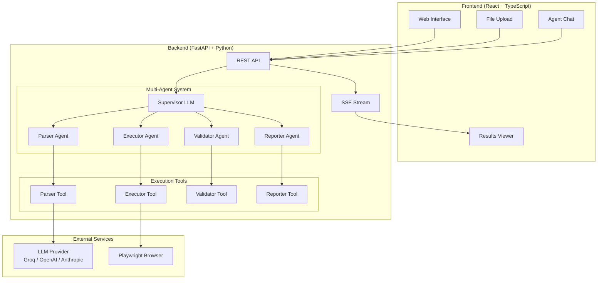
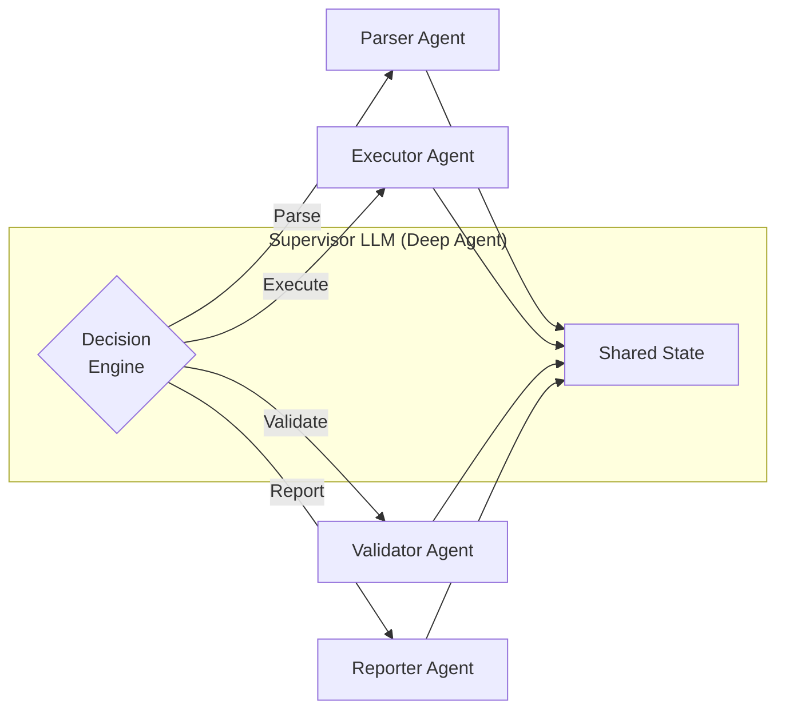
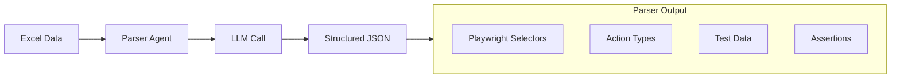
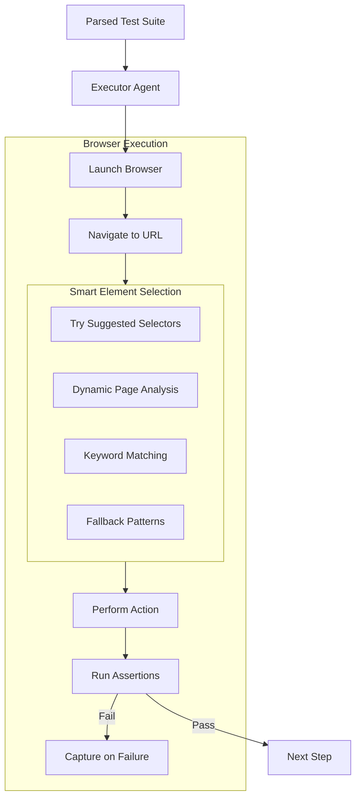
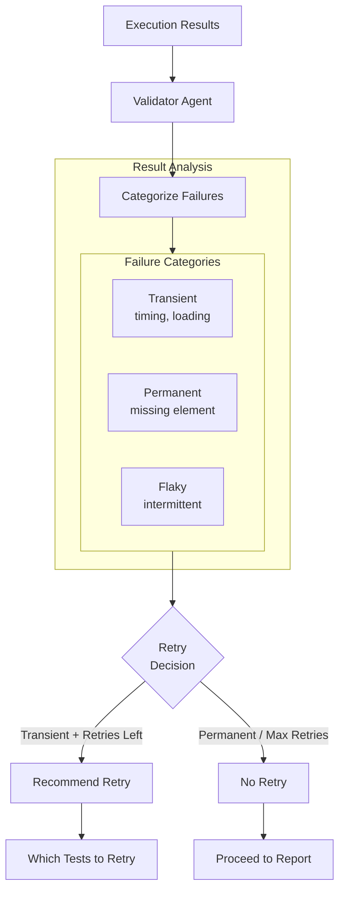
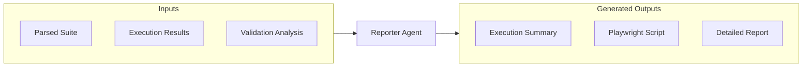
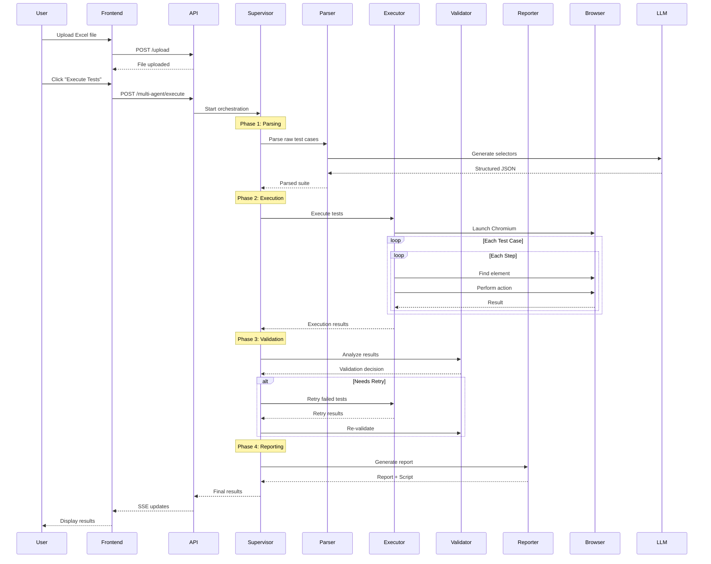
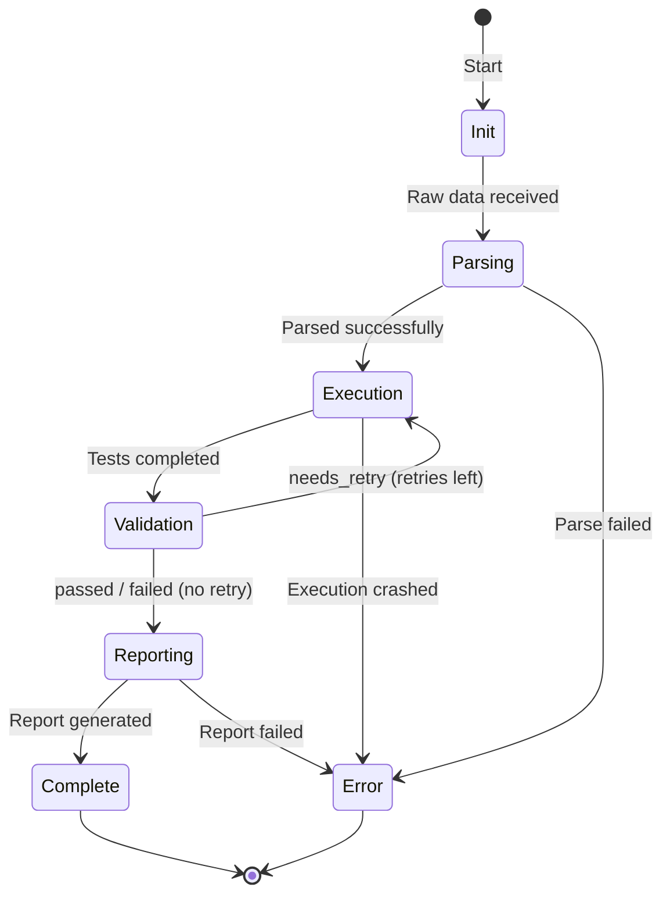

# AI-Powered Test Automation System

An intelligent test automation framework that uses **LLM-powered agents** to parse Excel test cases and execute them using **Playwright** browser automation. The system features a **Supervisor + Sub-Agents architecture** for orchestrating complex test workflows.

---

## Table of Contents

- [Overview](#overview)
- [Architecture](#architecture)
- [Agent System](#agent-system)
  - [Supervisor (Deep Agent)](#supervisor-deep-agent)
  - [Parser Agent](#parser-agent)
  - [Executor Agent](#executor-agent)
  - [Validator Agent](#validator-agent)
  - [Reporter Agent](#reporter-agent)
- [Workflow Diagrams](#workflow-diagrams)
- [Tech Stack](#tech-stack)
- [Getting Started](#getting-started)
- [Configuration](#configuration)

---

## Overview

This system transforms the traditional test automation workflow by using AI agents to:

1. **Parse natural language test cases** from Excel files
2. **Generate Playwright selectors** dynamically using LLM intelligence
3. **Execute tests** in real browsers with smart element detection
4. **Validate results** and decide on retry strategies
5. **Generate reports** and reusable Playwright scripts

```
Excel Test Cases  -->  AI Parser  -->  Browser Execution  -->  Smart Validation  -->  Reports
```

---

## Architecture

### High-Level System Architecture



---

## Agent System

The system uses a **Supervisor Pattern** where a central LLM (the Supervisor) coordinates specialized sub-agents. Each agent has a specific role and uses dedicated tools.

### Supervisor (Deep Agent)

The **Supervisor LLM** is the brain of the operation. It:

- Receives the overall task (test cases to execute)
- Decides which sub-agent should handle each phase
- Coordinates handoffs between agents
- Makes retry decisions based on validation results
- Tracks the overall workflow state



**Key Responsibilities:**
| Responsibility | Description |
|----------------|-------------|
| Orchestration | Decides which agent handles each task |
| State Management | Maintains shared state across all agents |
| Retry Logic | Determines if failed tests should be retried |
| Error Recovery | Handles failures and decides recovery strategy |

---

### Parser Agent

**Purpose:** Converts raw Excel test data into structured, Playwright-ready format.



**What it does:**
- Reads raw test case text from Excel
- Uses LLM to understand test steps and generate selectors
- Outputs structured JSON with:
  - `selector_hints`: Element names, types, suggested selectors
  - `action`: Type (click, fill, goto, assert) and Playwright method
  - `test_data`: Values to fill, URLs to navigate
  - `assertions`: Expected results to verify

**Example Transformation:**
```
INPUT (Excel):
"Enter 'admin@test.com' in the Email field"

OUTPUT (Structured):
{
  "instruction": "Enter 'admin@test.com' in the Email field",
  "action": { "type": "fill", "playwright_method": "page.fill()" },
  "selector_hints": {
    "element_name": "Email",
    "element_type": "input",
    "suggested_selectors": ["page.getByLabel('Email')", "page.locator('input[type=\"email\"]')"]
  },
  "test_data": { "email": "admin@test.com" }
}
```

---

### Executor Agent

**Purpose:** Runs tests in a real browser using Playwright.



**Key Features:**

| Feature | Description |
|---------|-------------|
| Smart Selector Resolution | Tries multiple selector strategies until one works |
| Dynamic Page Analysis | Scans the page for matching elements in real-time |
| Keyword Matching | Matches icon buttons by title, aria-label, alt attributes |
| Custom Dropdown Handling | Detects and handles non-native dropdowns (React, Tailwind) |
| Retry with Backoff | Retries failed steps with increasing timeouts |
| Screenshot Capture | Captures screenshots on step failures |

**Selector Priority System:**
1. Suggested selectors from Parser
2. Dynamic analysis (scan page for matching elements)
3. Keyword matching (for icon/toggle buttons)
4. Fallback patterns (common UI patterns)

---

### Validator Agent

**Purpose:** Analyzes test results and decides retry strategy.



**Validation Output:**
```json
{
  "validation_status": "needs_retry",
  "should_retry": true,
  "analysis": {
    "transient_failures": ["TC_001 Step 5: Timeout waiting for element"],
    "permanent_failures": [],
    "pass_rate": "80%"
  },
  "retry_tests": ["TC_001"]
}
```

**Retry Decision Logic:**
- **Transient failures** (timeouts, network issues): Recommend retry
- **Permanent failures** (element doesn't exist): Don't retry
- **Max retries reached**: Stop and report
- **All passed**: Proceed to reporting

---

### Reporter Agent

**Purpose:** Generates test reports and reusable Playwright scripts.



**Generated Outputs:**

1. **Execution Summary**
   - Pass/fail counts
   - Execution time
   - Failed step details

2. **Playwright Script**
   - Reusable TypeScript/JavaScript code
   - Uses actual selectors that worked
   - Can be run independently

3. **Detailed Report**
   - Step-by-step results
   - Screenshots of failures
   - Recommendations

---

## Workflow Diagrams

### Complete Test Execution Flow



### State Machine



---

## Tech Stack

### Backend
| Technology | Purpose |
|------------|---------|
| **FastAPI** | REST API framework |
| **Playwright** | Browser automation |
| **Pandas** | Excel file parsing |
| **Pydantic** | Data validation |
| **SSE** | Real-time updates |

### Frontend
| Technology | Purpose |
|------------|---------|
| **React 18** | UI framework |
| **TypeScript** | Type safety |
| **Zustand** | State management |
| **Tailwind CSS** | Styling |
| **Vite** | Build tool |

### LLM Providers
| Provider | Model | Use Case |
|----------|-------|----------|
| **Groq** | llama-3.1-8b-instant | Fast, cost-effective |
| **OpenAI** | gpt-4o | High accuracy |
| **Anthropic** | Claude Sonnet | Complex reasoning |

---

## Getting Started

### Prerequisites
- Python 3.10+
- Node.js 18+
- API key for at least one LLM provider

### Installation

```bash
# Clone the repository
git clone <repo-url>
cd test_automation

# Backend setup
python -m venv venv
venv\Scripts\activate  # Windows
pip install -r requirements.txt
playwright install chromium

# Frontend setup
cd frontend
npm install
```

### Environment Configuration

Create a `.env` file in the root directory:

```env
# LLM Provider (choose one: groq, openai, anthropic)
DEFAULT_LLM_PROVIDER=groq

# API Keys (only needed for providers you use)
GROQ_API_KEY=your_groq_key
OPENAI_API_KEY=your_openai_key
ANTHROPIC_API_KEY=your_anthropic_key

# Models
GROQ_MODEL=llama-3.1-8b-instant
OPENAI_MODEL=gpt-4o
ANTHROPIC_MODEL=claude-sonnet-4-20250514

# Execution Settings
STEP_MAX_RETRIES=3
DEFAULT_ACTION_TIMEOUT=30000
```

### Running the Application

```bash
# Terminal 1: Start backend
cd test_automation
venv\Scripts\activate
uvicorn app.main:app --reload --host 0.0.0.0 --port 8000

# Terminal 2: Start frontend
cd frontend
npm run dev
```

Open `http://localhost:5173` in your browser.

---

## Configuration

### Execution Settings

| Setting | Default | Description |
|---------|---------|-------------|
| `STEP_MAX_RETRIES` | 3 | Max retries per failed step |
| `RETRY_TIMEOUT_MULTIPLIER` | 1.3 | Timeout increase per retry |
| `DEFAULT_ACTION_TIMEOUT` | 30000 | Action timeout (ms) |
| `NAVIGATION_TIMEOUT` | 30000 | Page load timeout (ms) |

### Test Case Format

Excel files should have columns:
- **Test Case ID**: Unique identifier (TC_001)
- **Test Case Name**: Description of the test
- **Test Case Steps**: Natural language steps
- **Expected Results**: What should happen

Example steps:
```
1. Navigate to https://app.example.com
2. Enter "admin@test.com" in the Email field
3. Enter "password123" in the Password field
4. Click the Login button
5. Verify the Dashboard heading is visible
```

---

## Project Structure

```
test_automation/
├── app/
│   ├── agents/
│   │   ├── base_agent.py           # Base class for all agents
│   │   ├── enhanced_json_parser.py # LLM-powered parser
│   │   └── deep_agent/
│   │       ├── multi_agent_orchestrator.py  # Supervisor
│   │       ├── sub_agents/
│   │       │   ├── parser_agent.py
│   │       │   ├── executor_agent.py
│   │       │   ├── validator_agent.py
│   │       │   └── reporter_agent.py
│   │       └── tools/
│   │           ├── parser_tool.py
│   │           ├── executor_tool.py
│   │           ├── validator_tool.py
│   │           └── reporter_tool.py
│   ├── api/
│   │   └── routes/
│   │       ├── upload.py
│   │       ├── multi_agent.py
│   │       └── agent_chat.py
│   ├── tools/
│   │   └── enhanced_executor.py    # Playwright execution engine
│   └── core/
│       └── config.py               # Settings
├── frontend/
│   └── src/
│       ├── components/
│       │   ├── FileUpload/
│       │   ├── AgentChat/
│       │   ├── ExecutionPanel/
│       │   └── ResultsViewer/
│       └── store/
│           └── useStore.ts         # Zustand state
├── .env
└── README.md
```

---

## License

MIT License - See LICENSE file for details.
