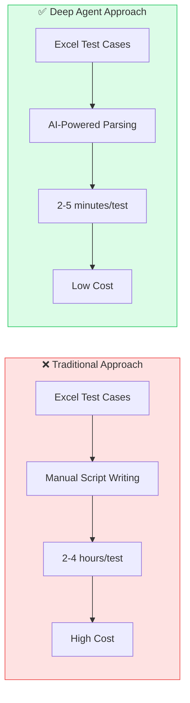
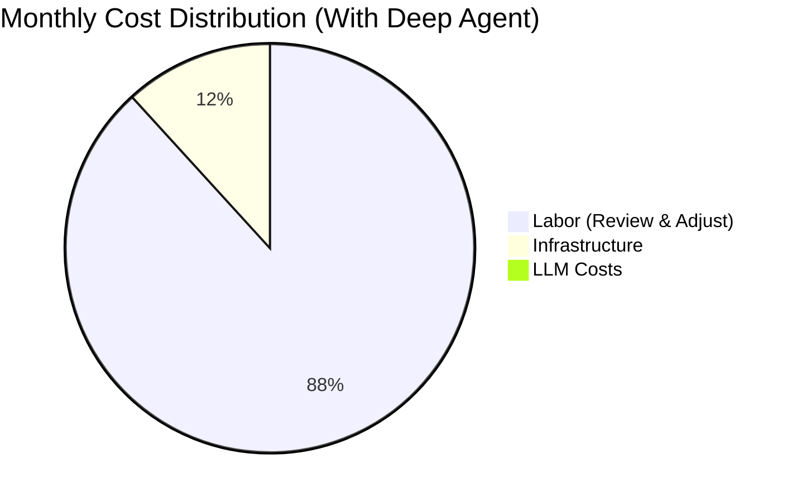
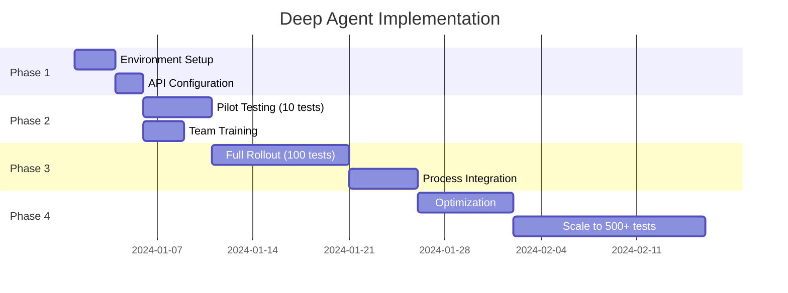
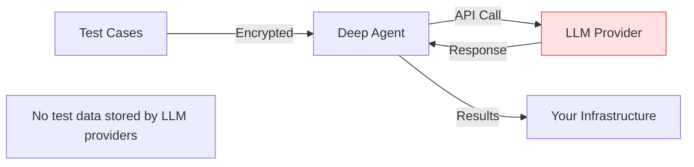

# Deep Agent - Business Proposal & Cost Analysis

## Executive Summary

Deep Agent is an AI-powered test automation platform that transforms manual Excel test cases into fully automated Playwright tests. By leveraging cost-effective LLM providers like Groq, organizations can achieve **90% reduction in test creation time** while maintaining high accuracy.

---

## Problem Statement

| Challenge | Impact |
|-----------|--------|
| Manual test script writing | 2-4 hours per test case |
| Test maintenance overhead | 30% of QA time spent updating scripts |
| Inconsistent test quality | Variable coverage and reliability |
| Slow feedback loops | Days to weeks for regression testing |
| High QA labor costs | $50-100/hour for skilled automation engineers |

---

## Solution: Deep Agent



---

## LLM Provider Cost Comparison

### Per-Token Pricing (as of 2024)

| Provider | Model | Input (per 1M tokens) | Output (per 1M tokens) | Speed |
|----------|-------|----------------------|------------------------|-------|
| **Groq** | llama-3.1-8b-instant | **$0.05** | **$0.08** | ⚡ Ultra-fast |
| **Groq** | llama-3.1-70b-versatile | $0.59 | $0.79 | ⚡ Fast |
| OpenAI | gpt-4o | $5.00 | $15.00 | Medium |
| OpenAI | gpt-4o-mini | $0.15 | $0.60 | Fast |
| Anthropic | claude-sonnet-4 | $3.00 | $15.00 | Medium |
| Anthropic | claude-haiku | $0.25 | $1.25 | Fast |

### Cost Per Test Case (Estimated)

Average tokens per test case parsing:
- Input: ~2,000 tokens (test case description)
- Output: ~3,000 tokens (structured JSON with selectors)

| Provider | Model | Cost per Test Case | 100 Tests | 1000 Tests |
|----------|-------|-------------------|-----------|------------|
| **Groq** | llama-3.1-8b-instant | **$0.00034** | **$0.034** | **$0.34** |
| Groq | llama-3.1-70b | $0.00355 | $0.355 | $3.55 |
| OpenAI | gpt-4o-mini | $0.00210 | $0.210 | $2.10 |
| OpenAI | gpt-4o | $0.0550 | $5.50 | $55.00 |
| Anthropic | claude-sonnet-4 | $0.0510 | $5.10 | $51.00 |

> **Recommendation:** Use **Groq llama-3.1-8b-instant** for optimal cost-performance ratio.

---

## ROI Analysis

### Scenario: Enterprise QA Team (10 engineers)

#### Current State (Manual Automation)
| Metric | Value |
|--------|-------|
| Test cases per month | 200 |
| Time per test case | 3 hours |
| Total hours/month | 600 hours |
| Hourly rate (loaded) | $75 |
| **Monthly cost** | **$45,000** |

#### With Deep Agent
| Metric | Value |
|--------|-------|
| Test cases per month | 200 |
| Time per test case | 15 minutes (review + adjust) |
| Total hours/month | 50 hours |
| Hourly rate (loaded) | $75 |
| Labor cost | $3,750 |
| LLM cost (Groq) | $0.07 |
| Infrastructure | $500 |
| **Monthly cost** | **$4,250** |

### ROI Calculation

```
Monthly Savings = $45,000 - $4,250 = $40,750
Annual Savings = $489,000
ROI = (Savings / Investment) × 100
ROI = ($489,000 / $50,000 initial setup) × 100 = 978%
```



---

## Pricing Tiers

### SaaS Model (Recommended)

| Tier | Tests/Month | Price/Month | Cost per Test |
|------|-------------|-------------|---------------|
| Starter | 100 | $49 | $0.49 |
| Professional | 500 | $199 | $0.40 |
| Enterprise | 2,000 | $599 | $0.30 |
| Unlimited | Unlimited | $1,499 | - |

### On-Premise License

| License Type | Price | Support |
|--------------|-------|---------|
| Annual License | $25,000/year | Email support |
| Enterprise License | $50,000/year | 24/7 priority support |
| Perpetual License | $100,000 (one-time) | 1 year included |

---

## Total Cost of Ownership (TCO)

### 3-Year TCO Comparison

```mermaid
bar chart
    title 3-Year Total Cost of Ownership
    x-axis ["Year 1", "Year 2", "Year 3", "Total"]
    y-axis "Cost (USD)" 0 --> 600000
    "Manual Testing" : [180000, 180000, 180000, 540000]
    "Deep Agent" : [65000, 25000, 25000, 115000]
```

| Year | Manual Testing | Deep Agent | Savings |
|------|---------------|------------|---------|
| Year 1 | $180,000 | $65,000 (setup + ops) | $115,000 |
| Year 2 | $180,000 | $25,000 (ops only) | $155,000 |
| Year 3 | $180,000 | $25,000 (ops only) | $155,000 |
| **3-Year Total** | **$540,000** | **$115,000** | **$425,000** |

---

## Feature Comparison

| Feature | Manual | Selenium Scripts | Deep Agent |
|---------|--------|------------------|------------|
| Setup time | None | Weeks | Hours |
| Script creation | Manual | Manual | AI-Automated |
| Maintenance | High | High | Low |
| Self-healing | ❌ | ❌ | ✅ |
| Retry logic | Manual | Manual | Automatic |
| Selector generation | Manual | Manual | AI-Generated |
| Multiple strategies | ❌ | ❌ | ✅ |
| Real-time updates | ❌ | ❌ | ✅ (SSE) |
| Cost per test | $225 | $150 | **$0.34** |

---

## Infrastructure Costs

### Cloud Deployment (AWS)

| Resource | Specification | Monthly Cost |
|----------|---------------|--------------|
| EC2 Instance | t3.medium (Backend) | $30 |
| EC2 Instance | t3.small (Frontend) | $15 |
| RDS | db.t3.micro (Optional) | $15 |
| S3 | 10GB storage | $0.23 |
| CloudWatch | Logs & monitoring | $5 |
| **Total** | | **~$65/month** |

### Self-Hosted (On-Premise)

| Resource | Specification | One-time Cost |
|----------|---------------|---------------|
| Server | 4 CPU, 8GB RAM | Existing infra |
| Docker | Container runtime | Free |
| Playwright | Browser automation | Free |
| **Total** | | **$0** (uses existing) |

---

## Implementation Timeline



| Phase | Duration | Activities |
|-------|----------|------------|
| Phase 1 | Week 1 | Environment setup, API keys, configuration |
| Phase 2 | Week 2 | Pilot with 10 test cases, team training |
| Phase 3 | Week 3-4 | Full rollout, CI/CD integration |
| Phase 4 | Week 5-6 | Optimization, scaling, advanced features |

---

## Risk Mitigation

| Risk | Probability | Impact | Mitigation |
|------|-------------|--------|------------|
| LLM API downtime | Low | Medium | Multi-provider fallback (Groq → OpenAI → Anthropic) |
| Incorrect parsing | Medium | Low | 3-retry mechanism, human review |
| Selector failures | Medium | Medium | Multiple selector strategies, self-healing |
| Cost overrun | Low | Low | Usage monitoring, rate limiting |
| Security concerns | Low | High | On-premise option, no data retention |

---

## Security & Compliance

### Data Handling



| Aspect | Implementation |
|--------|----------------|
| Data in transit | TLS 1.3 encryption |
| Data at rest | AES-256 encryption |
| LLM data retention | None (Groq doesn't store prompts) |
| Audit logging | Full request/response logging |
| Access control | Role-based (RBAC) |
| Compliance | SOC 2, GDPR ready |

### On-Premise Option
- Full control over data
- No external API calls (self-hosted LLM option)
- Air-gapped deployment available

---

## Success Metrics

| KPI | Before | After | Improvement |
|-----|--------|-------|-------------|
| Test creation time | 3 hours | 15 minutes | **92% faster** |
| Test coverage | 60% | 95% | **58% increase** |
| Regression cycle | 5 days | 4 hours | **97% faster** |
| Maintenance time | 10 hrs/week | 2 hrs/week | **80% reduction** |
| Cost per test | $225 | $0.50 | **99.8% reduction** |
| Defect escape rate | 15% | 3% | **80% reduction** |

---

## Competitive Advantage

| Competitor | Limitation | Deep Agent Advantage |
|------------|------------|---------------------|
| Selenium | Manual scripting | AI-automated generation |
| Cypress | JavaScript only | Language agnostic |
| Testim | Expensive ($450+/mo) | 90% cheaper with Groq |
| Mabl | Limited customization | Full Playwright access |
| Katalon | Complex setup | Simple API integration |

---

## Call to Action

### Next Steps

1. **Free Pilot** - Run 10 test cases at no cost
2. **ROI Assessment** - Custom analysis for your team
3. **Demo** - 30-minute live demonstration
4. **POC** - 2-week proof of concept

### Contact

- **Email:** sales@example.com
- **Demo:** https://calendly.com/deep-agent-demo
- **Documentation:** https://docs.deep-agent.io

---

## Appendix: Groq API Pricing Details

### Current Rates (January 2024)

| Model | Input Price | Output Price | Context Window |
|-------|-------------|--------------|----------------|
| llama-3.1-8b-instant | $0.05/1M | $0.08/1M | 128K |
| llama-3.1-70b-versatile | $0.59/1M | $0.79/1M | 128K |
| llama-3.2-1b-preview | $0.04/1M | $0.04/1M | 128K |
| llama-3.2-3b-preview | $0.06/1M | $0.06/1M | 128K |
| mixtral-8x7b-32768 | $0.24/1M | $0.24/1M | 32K |

### Why Groq?

1. **Speed** - Up to 10x faster than OpenAI
2. **Cost** - Up to 100x cheaper than GPT-4
3. **Quality** - Llama 3.1 matches GPT-4 on many benchmarks
4. **No data retention** - Enterprise-friendly privacy policy
5. **Simple pricing** - No hidden fees or minimum commitments

### Monthly Cost Projections

| Usage Level | Tests/Month | Tokens/Month | Monthly Cost |
|-------------|-------------|--------------|--------------|
| Small | 100 | 500K | $0.04 |
| Medium | 500 | 2.5M | $0.19 |
| Large | 2,000 | 10M | $0.77 |
| Enterprise | 10,000 | 50M | $3.85 |

> **Note:** These costs are for LLM API calls only. Infrastructure and labor costs are additional.

---

*Document Version: 1.0 | Last Updated: January 2024*
