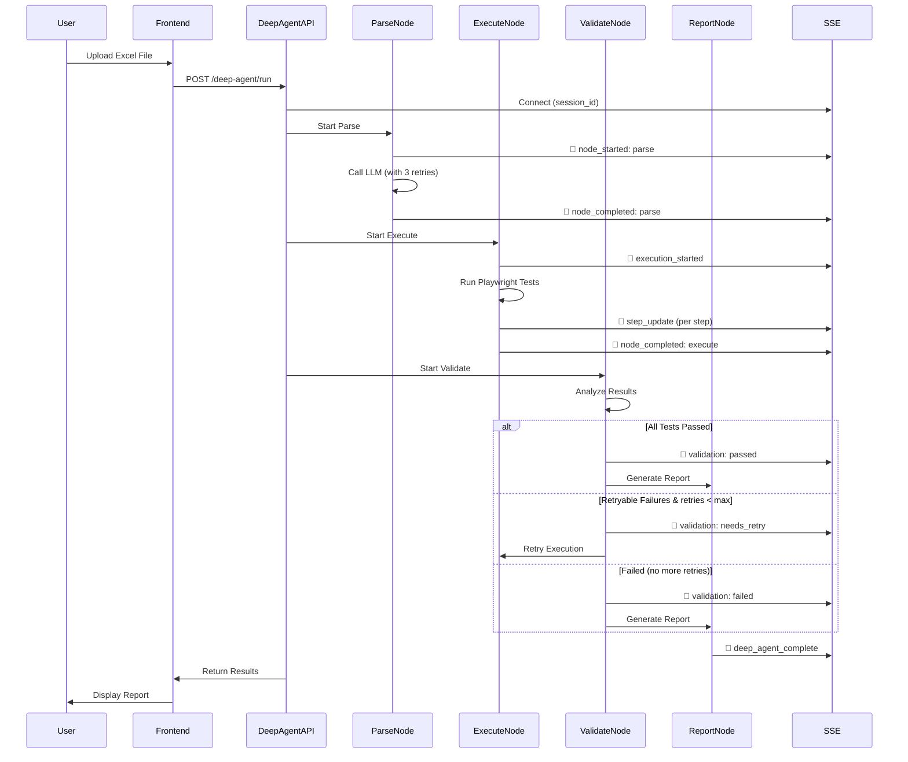
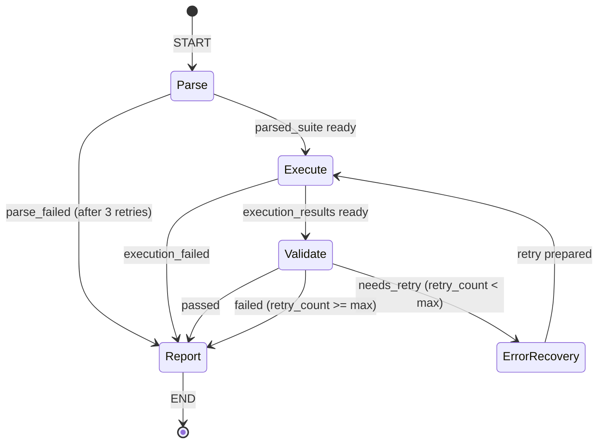

# Deep Agent - LangGraph Test Automation Orchestrator

## Overview

Deep Agent is an intelligent test automation orchestrator built on **LangGraph** that automates the full pipeline from raw Excel test cases to executed Playwright tests with automatic retry and reporting.

It wraps the existing working APIs (`/parse-enhanced`, `/execute-enhanced`) into a stateful workflow that can self-heal and retry on failures.

## Architecture

```mermaid
flowchart TD
    subgraph Input
        A[📄 Excel/JSON Upload] --> B[Raw Test Data]
    end

    subgraph DeepAgent["🤖 Deep Agent (LangGraph StateGraph)"]
        B --> C[Parse Node]
        C -->|"Calls /parse-enhanced logic"| D[Execute Node]
        D -->|"Calls /execute-enhanced logic"| E[Validate Node]

        E -->|"✅ All Passed"| F[Report Node]
        E -->|"⚠️ Retryable Failures"| G[Error Recovery Node]
        E -->|"❌ Failed (max retries)"| F

        G -->|"Increment retry count"| D
    end

    subgraph Output
        F --> H[📊 Test Report]
        F --> I[📝 Playwright Script]
        F --> J[📈 Execution Results]
    end

    style DeepAgent fill:#1a1a2e,stroke:#6366f1,stroke-width:2px
    style C fill:#3b82f6,stroke:#1e40af
    style D fill:#22c55e,stroke:#15803d
    style E fill:#f59e0b,stroke:#b45309
    style F fill:#8b5cf6,stroke:#6d28d9
    style G fill:#ef4444,stroke:#b91c1c
```



## Flow Diagram



## State Machine



## Components

### 1. Parse Node (`parse_node.py`)
Converts raw Excel/JSON test data into structured test suite format.

**What it does:**
- Calls `EnhancedJsonParserAgent.parse_to_enhanced_structure()`
- Same logic as `/api/v1/parse-enhanced` endpoint
- Includes 3 retry attempts for JSON parse failures
- Generates selector hints, action types, and assertions

**Input:** Raw test case data from Excel
**Output:** Structured `parsed_suite` with test cases, steps, selectors

### 2. Execute Node (`execute_node.py`)
Runs Playwright tests from the parsed test suite.

**What it does:**
- Calls `execute_enhanced()` function
- Same logic as `/api/v1/execute-enhanced` endpoint
- Executes tests with intelligent selector resolution
- Captures screenshots on failures

**Input:** `parsed_suite` from Parse Node
**Output:** `execution_results` with pass/fail status per test

### 3. Validate Node (`validate_node.py`)
Analyzes execution results and decides next action.

**What it does:**
- Checks for errors from previous steps
- Analyzes test results (passed/failed counts)
- Determines if failures are retryable (timeouts, element not found)
- Decides: `passed`, `failed`, or `needs_retry`

**Retryable Failures:**
- Timeout errors
- Element not found
- Network errors
- Navigation errors

**Non-Retryable Failures:**
- Assertion failures (expected != actual)
- Missing test data
- Configuration errors

### 4. Error Recovery Node (`error_recovery_node.py`)
Prepares state for retry attempts.

**What it does:**
- Increments retry counter
- Clears previous execution results
- Can adjust timeouts (1.5x on retry 1, 2x on retry 2+)
- Resets validation status to `pending`

### 5. Report Node (`report_node.py`)
Generates final report and Playwright script.

**What it does:**
- Calls `generate_enhanced_pytest_script()`
- Builds comprehensive test report
- Includes pass rates, screenshots, selector mappings
- Broadcasts `deep_agent_complete` event

## API Endpoints

### POST `/api/v1/deep-agent/run`

Run the full Deep Agent workflow.

**Query Parameters:**
| Parameter | Type | Default | Description |
|-----------|------|---------|-------------|
| `session_id` | string | required | SSE session ID for real-time updates |
| `llm_provider` | string | "groq" | LLM provider: anthropic, openai, groq |
| `model` | string | auto | Model name (auto-selected based on provider) |
| `project_name` | string | "Automation Project" | Project name |
| `base_url` | string | auto-detected | Base URL for tests |
| `headless` | boolean | true | Run browser in headless mode |
| `timeout` | integer | 30000 | Playwright timeout in ms |
| `max_retries` | integer | 2 | Maximum retry attempts |

**Request Body:**
```json
{
  "raw_data": [
    {
      "T.C.No": 1,
      "Test Case": "Login Test",
      "Test Case Steps": "Step 1: Navigate to URL...",
      "Expected Result": "User should login successfully"
    }
  ]
}
```

**Response:**
```json
{
  "status": "success",
  "message": "Deep Agent completed - 5/5 passed",
  "validation_status": "passed",
  "summary": {
    "total": 5,
    "passed": 5,
    "failed": 0,
    "retries": 0
  },
  "execution_results": { ... },
  "report": { ... },
  "generated_script": "import pytest\nfrom playwright...",
  "errors": [],
  "completed_at": "2024-01-27T10:30:00Z"
}
```

### GET `/api/v1/deep-agent/status/{session_id}`

Check Deep Agent execution status.

**Response:**
```json
{
  "session_id": "session_123",
  "has_active_connections": true,
  "connection_count": 1
}
```

## SSE Events

Connect to `/api/v1/sse/{session_id}` before calling Deep Agent to receive real-time updates.

| Event Type | Description |
|------------|-------------|
| `agent_phase` | Workflow phase transitions (starting, parse, execute, validate, complete) |
| `node_started` | Individual node lifecycle start |
| `node_completed` | Individual node lifecycle end |
| `thoughts` | Agent reasoning/decisions |
| `execution_started` | Test execution beginning |
| `step_update` | Individual step progress |
| `deep_agent_complete` | Workflow finished |

## Configuration

### Environment Variables (`.env`)

```env
# LLM Provider (groq is default - fast and cost-effective)
DEFAULT_LLM_PROVIDER=groq

# Groq Configuration
GROQ_API_KEY=your_groq_api_key
GROQ_MODEL=llama-3.1-8b-instant

# OpenAI Configuration (optional)
OPENAI_API_KEY=your_openai_api_key
OPENAI_MODEL=gpt-4o

# Anthropic Configuration (optional)
ANTHROPIC_API_KEY=your_anthropic_api_key
ANTHROPIC_MODEL=claude-sonnet-4-20250514
```

## File Structure

```
app/agents/deep_agent/
├── __init__.py              # Package exports
├── state.py                 # TestAutomationState TypedDict
├── graph.py                 # LangGraph StateGraph builder
└── nodes/
    ├── __init__.py          # Node exports
    ├── parse_node.py        # Parse raw data → test suite
    ├── execute_node.py      # Run Playwright tests
    ├── validate_node.py     # Analyze results, decide retry
    ├── report_node.py       # Generate report & script
    └── error_recovery_node.py  # Prepare for retry

app/api/routes/
└── deep_agent.py            # API endpoints
```

## Usage Example

### Frontend (TypeScript)

```typescript
import { executeDeepAgent } from './services/api';

// Connect to SSE first
const eventSource = new EventSource(`/api/v1/sse/${sessionId}`);
eventSource.onmessage = (event) => {
  const data = JSON.parse(event.data);
  console.log('SSE Event:', data.type, data.message);
};

// Run Deep Agent
const result = await executeDeepAgent(rawTestCases, sessionId, {
  projectName: 'My Test Project',
  baseUrl: 'https://example.com',
  llmProvider: 'groq',
  headless: false,
  maxRetries: 2
});

console.log(`Result: ${result.summary.passed}/${result.summary.total} passed`);
```

### Direct API Call (curl)

```bash
curl -X POST "http://localhost:8000/api/v1/deep-agent/run?session_id=test123&llm_provider=groq&headless=true" \
  -H "Content-Type: application/json" \
  -d '{
    "raw_data": [
      {
        "T.C.No": 1,
        "Test Case": "Login Test",
        "Test Case Steps": "Navigate to https://example.com/login\nEnter email: test@test.com\nEnter password: password123\nClick Login button",
        "Expected Result": "User should see dashboard"
      }
    ]
  }'
```

## Error Handling

### Parse Failures
- Automatic 3 retries with 1-second delay
- Invalid JSON escape sequences are auto-fixed
- Falls back with clear error message after all retries

### Execution Failures
- Retryable errors (timeouts, element not found) trigger retry
- Non-retryable errors (assertions) go straight to report
- Screenshots captured on failure

### Validation
- Checks for errors from all previous steps
- Properly reports "failed" status instead of false "passed"

## Comparison: Direct Flow vs Deep Agent

| Aspect | Direct Flow | Deep Agent |
|--------|-------------|------------|
| Orchestration | Frontend manages | LangGraph manages |
| Retry Logic | Manual | Automatic (up to max_retries) |
| Error Recovery | None | Intelligent (adjusts timeouts) |
| State Management | Frontend state | Centralized StateGraph |
| Real-time Updates | SSE | SSE (same infrastructure) |
| Use Case | Simple execution | Complex workflows with retry |

## Dependencies

```
langgraph>=0.2.0
tenacity>=8.2.3
playwright>=1.41.0
```
